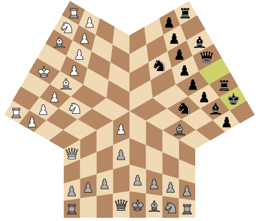

# 3chess

Chess for three players.

<p align="center">
  <a href="https://github.com/magnickolas/3chess">
    
  </a>
</p>

## Usage

First, you need to have [node](https://nodejs.org) and [npm](https://www.npmjs.com) be installed.

To install dependencies run the following command inside the repository's directory:

```console
npm install
```

Then you can run a server (by default it's available on port 2000, in order to change it follow
instructions in the section [Configuration](#configuration)):

```console
node app.js
```

The game starts as soon as three players opens its link (in a local network with the default
configuration that would be `http://localhost:2000`).

If you want to play in a non-local network, I suggest to set up a tunnel with e.g. [ngrok](https://ngrok.com).

## Configuration

You can change time control, additional time per move and the port that server runs on by changing
the values in `config.js` or pass them as command line arguments as follows:

```console
node app.js -p 2000 -t 15 -a 1 # port 2000, time control 15 minutes, time advance 1 second per move
```

## Contribution

The code's been written hastily and is literally garbage.

However, if you have some issues you can write about them [here](https://github.com/magnickolas/3chess/issues).
